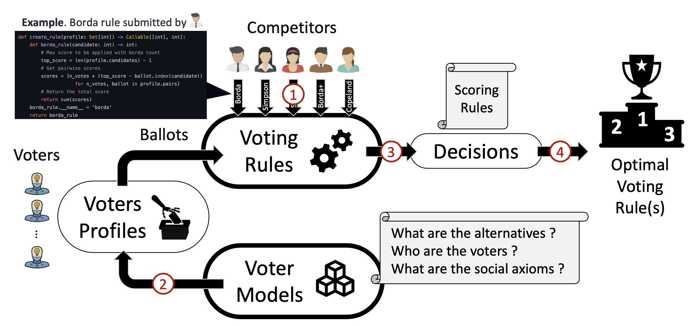
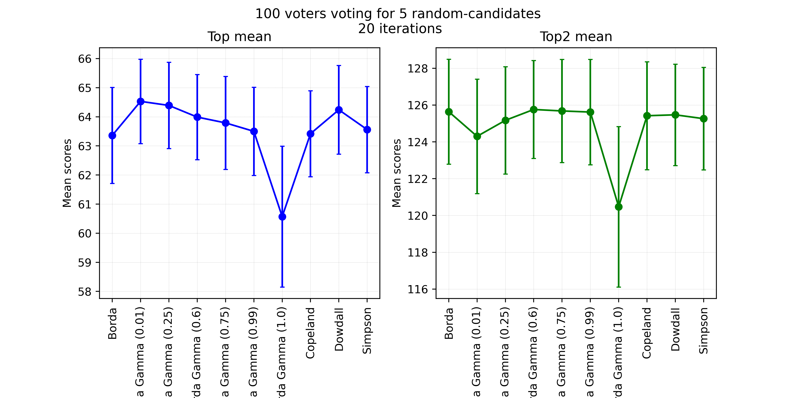
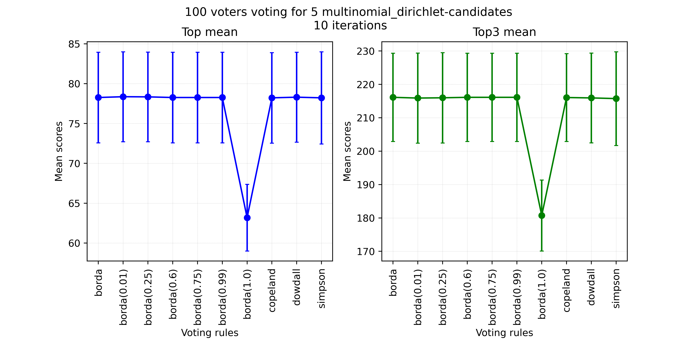

<a  name="_"></a>

<p align="center">
  <a href="https://github.com/raviq/compsoc">
    
  </a>
</p>

# Computational Social Choice Competition (COMPSOC) [](https://www.gnu.org/licenses/gpl-3.0) [](https://www.python.org/downloads/release/python-390/)

## Overview of the Competition

The field of [computational social choice (COMSOC)](https://en.wikipedia.org/wiki/Computational_social_choice) combines ideas, techniques, and models from computer science and social choice theory for aggregating collective preferences. This thriving and multidisciplinary field of research has numerous applications to group decision-making, resource allocation, fair division, and election systems. One of the most well-studied problems in COMSOC focuses on designing voting mechanisms for selecting the winning candidates for an election. Paradoxes and impossibility results are commonly encountered when implementing voting rules in electoral systems. Researchers are therefore exploring alternatives to classical voting mechanisms by incorporating, for instance, principles and techniques from Machine Learning. Agent-based simulations can also tackle such challenges, as evidenced by their successful applications in negotiation research, supply chain management, and energy markets. In line with this vision, [The 1st Computational Social Choice Competition at IJCAI 2023 (COMPSOC 2023)](https://compsoc.algocratic.org/) capitalizes on the progress in agent and computational social choice research. to drive the development of inclusive, robust, and fair election systems.

## Goals of the Competition

The Computational Social Choice Competition (COMPSOC) aims to advance the research in computational social choice by leveraging multiagent simulations and machine learning techniques. The competition will focus on the principled evaluation and analysis of voting rules in a competitive setting. The competitors will develop and submit the code of their voting rules, which will then be compared in a tournament based on social welfare and axiomatic satisfiability. The competition aims at providing valuable insights into the performances of voting mechanisms defined over parametrically generated voting problems, alternatives, and voters. COMPSOC will bring together researchers from the fields of computational social choice, social sciences, political sciences, multiagent systems, and machine learning and provide a unique benchmark for evaluating voting mechanisms in various synthetic (or real) problem domains. The competition also aims at advancing the field by providing a systematic approach to designing and assessing voting mechanisms in the absence of established theoretical results. This advancement will help bridge the gap between axiomatic and experimental analysis of voting systems, ultimately leading to improved explainability.

## Registration

To take part in the competition, you must register on the [COMPSOC main page](https://compsoc.algocratic.org/) under menu `COMPSOC 2023`.

## General Guidelines

The flow of the competition is illustrated in the figure. In step *(1)*, the competitors must register on the [COMPSOC main page](https://compsoc.algocratic.org/) under menu `COMPSOC 2023` to be allowed to their accounts. In step *(2)*, the competitors implement their voting rules using this Python SDK and then upload them to the site. In step *(3)*, synthetic voting profiles will be parametrically generated using various state-of-the-art [voter models](https://en.wikipedia.org/wiki/Voter_model). In step *(4)*, we will separately apply the competitors' [voter rules](https://en.wikipedia.org/wiki/Social_choice_theory) to the generated baseline of profiles. In step *(5)*, the optimal voting rules will be selected based on social welfare and how well they satisfy anonymity, neutrality, monotonicity, Pareto optimality, unanimity, and non-imposition.

<p align="center">

</p>

The top 3 winning competitors are the competitors with the voting rules that yield the highest social welfare for the multiagent voters (given the baseline ballots of the competition) while satisfying the properties mentioned above. Various sample codes of well-known voting rules will be provided to the participants to guide their implementations (including Borda, Copeland, Dowdall, etc.).

In addition to submitting the Python code of their voting mechanisms, the participants are expected to submit a report describing their mechanism, implementation, and expected results. This will help disseminate the lessons learned from running the competition to the community and set the direction for future tournaments.

## The COMPSOC SDK

This repository contains the official SDK for developing the mechanisms to be submited to the COMPSOC competition. It contains a package called `compsoc` for the competition. The competitors will develop their `voting rules` and evaluate them using some `voter models`. See the examples below.

### Voting rules

The voting rules are defined in terms of scores. That is, the rule takes a candidate and returns its
score. The obtained scores for all of the candidates could then be used to determine the winner(s).
For instance, the `Borda` score is implemented in `profile.py` as following.

```python
def borda_rule(candidate: int) -> int:
    """
    Parameters: candidate (base candidate for scoring)
    """
    # Max score to be applied with borda count
    top_score = len(profile.candidates) - 1
    # Get pairwise scores
    scores = [n_votes * (top_score - ballot.index(candidate))
              for n_votes, ballot in profile.pairs]
    # Return the total score
    return sum(scores)
```

Other scores could be re-defined in `profile.py`.

### Voter Models

In general, voters rank the candidates according to preferences that are often defined as
permutations over the set of candidates. Such preferences could be defined in
different [ways](https://github.com/raviq/Genon).

Another way to define the voter models is to assume that the votes follow particular distributions.
In the following, we define the distribution of the votes according to 3 methods.

1. Random distribution of the votes, implemented in

```python
generate_random_votes(number_voters, number_candidates)
```

2. Gaussian distribution of the votes, implemented in

```python
generate_gaussian_votes(mu, stdv, number_voters, number_candidates)
```

3. Dirichlet-Multinomial distribution of the votes, implemented in

```python
generate_multinomial_dirichlet_votes(alpha, num_voters, num_candidates)
```

## Files

The main files of the package SDK are:

| File | Description |
| ---- | --- |
| [**run.py**](run.py) | This is the main entry point. Takes the number of candidates `num_candidates`, the number of voters `num_voters`, the number of trials to run `number_iterations`, and the model `voters_model` to generate the voters' population. |
| [**models.py**](./models.py) | Defining the models to adopt when generating the popuations of the voters. There are currently Random, Gaussian, and Multinomial-Dirichlet models. |
| [**profile.py**](compsoc/profile.py) | All voting rules are defined and extended in the `Profile` class. |
| [**utils.py**](compsoc/utils.py) | Rendering utils. |

### Usage

Run on the terminal the command

```
python3.9 run.py [-h] [-v] num_candidates num_voters num_iterations num_topn voters_model
```

### Examples

To run 10 trials with `Dowdall`, `Simpson`, `Copeland`, and `Borda` rules for 5 candidates and 100
voters with random votes, run the command:

```
python3.9 run.py 5 100 20 2 "random"
```

The visual result is generated in `figures/scores_random.png`

<p align="center">

</p>

Similarly, for a Multinomial-Dirichlet distribution of the votes, run the following command:

```
python3.9 run.py 5 100 10 3 "multinomial_dirichlet"
```

The result is generated in `figures/scores_multinomial_dirichlet.png`

<p align="center">

</p>

## Before uploading rules to the COMPSOC server

Please make sure your code is compliant with the COMPSOC container `restricted_globals`. That is, you are only allowed to use these operators and libraries when developing :your rules

```
restricted_globals = {
            "__builtins__": utility_builtins,
            "np": np,  # Numpy
            "len": len,
            "range": range,
            "sum": sum,
            "min": min,
            "max": max,
            "float": float,
            "int": int,
            "random": random,
            "itertools": itertools,
            "typing": typing,
            "collections": collections,
            "_getiter_": default_guarded_getiter,
            "_iter_unpack_sequence_": guarded_iter_unpack_sequence,  # List unpacking
            "_apply_": _apply,  # Args kwargs
            "_getitem_": default_guarded_getitem,  # Arrays
            "_getattr_": default_guarded_getattr
        }
```
        
## Installation

```
TBD
```

You can also install the in-development version from GitHub with:

```
TBD
```

## Documentation

[https://raviq.github.io/compsoc/compsoc.html](https://raviq.github.io/compsoc/compsoc.html)

## Dependencies

* Python3.9
* Numpy
* Matplotlib
* Pandas
* [Tqdm](https://github.com/tqdm/tqdm)

## Licence & Copyright

This software was developed in the hope that it would be of some use to the AI research community,
and is freely available for redistribution and/or modification under the terms of the GNU General
Public Licence. It is distributed WITHOUT WARRANTY; without even the implied warranty of
merchantability or fitness for a particular purpose. See
the [GNU General Public License](https://github.com/raviq/Genon/blob/master/LICENCE.md) for more
details.

If you find this code to be of any use, please let me know. I would also welcome any feedback.

Copyright (c) 2023 Rafik Hadfi, rafik [dot] hadfi [at] gmail [dot] com
