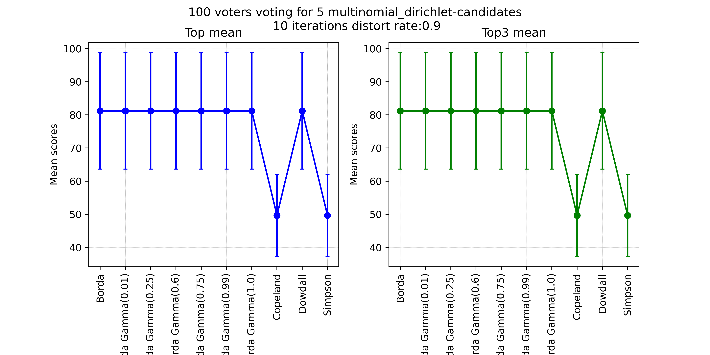

<a  name="_"></a>

<p align="center">
  <a href="https://github.com/raviq/compsoc">
    
  </a>
</p>

# Computational Social Choice Competition (COMPSOC) [](https://www.gnu.org/licenses/gpl-3.0) [](https://www.python.org/downloads/release/python-390/)

## Overview of the Competition

The field of [computational social choice (COMPSOC)](https://en.wikipedia.org/wiki/Computational_social_choice) combines ideas, techniques, and models from computer science and social choice theory for aggregating collective preferences. This thriving and multidisciplinary field of research has numerous applications to group decision-making, resource allocation, fair division, and election systems. One of the most well-studied problems in COMSOC focuses on designing voting mechanisms for selecting the winning candidates for an election. Paradoxes and impossibility results are commonly encountered when implementing voting rules in electoral systems. Researchers are therefore exploring alternatives to classical voting mechanisms by incorporating, for instance, principles and techniques from Machine Learning. Agent-based simulations can also tackle such challenges, as evidenced by their successful applications in negotiation research, supply chain management, and energy markets. In line with this vision, [The 1st Computational Social Choice Competition at IJCAI 2023 (COMPSOC 2023)](https://compsoc.algocratic.org/) capitalizes on the progress in agent research and computational social choice to drive the development of inclusive, robust, and fair election systems.

## Goals of the Competition

COMPSOC aims to advance research in computational social choice by leveraging multiagent simulations and machine learning techniques. The competition will focus on the principled evaluation and analysis of voting rules in a competitive setting. The competitors will develop and submit the code of their voting rules, which will then be compared in a tournament based on social welfare and axiomatic satisfiability (anonymity, neutrality, monotonicity, Pareto optimality, unanimity, and non-imposition). The competition aims at providing valuable insights into the performances of voting mechanisms defined over parametrically generated voting problems, alternatives, and voters. COMPSOC will bring together researchers from computational social choice, social sciences, political sciences, multiagent systems, and machine learning and provide a unique benchmark for evaluating voting mechanisms in various synthetic (or real) problem domains. The competition also aims to advance the field by providing a systematic approach to designing and assessing voting mechanisms without established theoretical results. This advancement will help bridge the gap between axiomatic and experimental analysis of voting systems, ultimately leading to improved explainability.

## Registration

To participate in the competition, you must register on the [COMPSOC registration page](https://compsoc.algocratic.org/registration).

## General Guidelines

The flow of the competition is illustrated in the figure. In step *(1)*, the competitors register on the [COMPSOC main page](https://compsoc.algocratic.org/) under the menu `COMPSOC 2023` to be allowed to access their accounts. In step *(2)*, the competitors implement their voting rules using this Python SDK and then upload them to the site. In step *(3)*, synthetic voting profiles will be parametrically generated using various state-of-the-art [voter models](https://en.wikipedia.org/wiki/Voter_model). In step *(4)*, we will separately apply the competitors' [voter rules](https://en.wikipedia.org/wiki/Social_choice_theory) to the generated baseline of profiles. In step *(5)*, the optimal voting rules will be selected based on social welfare and how well they satisfy anonymity, neutrality, monotonicity, Pareto optimality, unanimity, and non-imposition.

<p align="center">

</p>

The top 3 winning competitors are the competitors with the voting rules that yield the highest social welfare for the multiagent voters (given the baseline ballots of the competition) while satisfying the properties mentioned above. Various sample codes of well-known voting rules will be provided to the participants to guide their implementations (including Borda, Copeland, Dowdall, etc.).

In addition to submitting the Python code of their voting mechanisms, the participants must submit a report describing their mechanism, implementation, and expected results. This will help disseminate the lessons learned from running the competition to the community and set the direction for future tournaments.

The detailed guidelines can be found [here](https://compsoc.algocratic.org/guidelines).

## The COMPSOC SDK

This repository contains the official SDK for developing the mechanisms to be submitted to the COMPSOC competition. It contains a package called `compsoc` for the competition. The competitors will develop their `voting rules` and evaluate them using some `voter models`. See the examples below.

### Voting rules

The voting rules are defined in terms of scores. That is, the rule takes a candidate and returns its
score. The obtained scores for all candidates could then determine the winner(s).
For instance, the `Borda` score is implemented in `profile.py`.

```python
"""
Computes the Borda score for a candidate.
"""
from compsoc.profile import Profile

def borda_rule(profile: Profile, candidate: int) -> int:
    """
    Calculates the Borda score for a candidate based on a profile.
    :param profile: The voting profile.
    :type profile: VotingProfile
    :param candidate: The base candidate for scoring.
    :type candidate: int
    :return: The Borda score for the candidate.
    :rtype: int
    """
    # Max score to be applied with borda count
    top_score = len(profile.candidates) - 1
    # Get pairwise scores
    scores = 0
    for pair in profile.pairs:
        # Adds score only if the candidate appears in the ballots. 
        # Supports the case when the ballots are distorted.
        if candidate in pair[1]:
            scores += pair[0] * (top_score - pair[1].index(candidate))  
    return scores
```

Other scores could be re-defined in `profile.py`.

### Voter Models

In general, voters rank the candidates according to preferences, often defined as
permutations over the set of candidates. Such preferences could be defined in
different [ways](https://github.com/raviq/Genon).

Another way to define the voter models is to assume that the votes follow particular distributions.
In the following, we define the distribution of the votes according to 3 methods.

| Distribution of the votes | Function in SDK |
| ---- | --- |
| Random | ```generate_random_votes(number_voters, number_candidates) ``` |
| Gaussian | ```generate_gaussian_votes(mu, stdv, number_voters, number_candidates) ``` |
| Dirichlet-Multinomial | ```generate_multinomial_dirichlet_votes(alpha, num_voters, num_candidates) ```|

Note that profiles, or ballots, could be distorted in various ways. For now, we will adopt a method to remove the `distortion_rate %` of each vote where `distortion_rate` is in the range `[0, 1[`. For example, `distortion_rate=0.2` means that `20%` of the vote will be removed.
        
## Installation

To use the COMPSOC SDK, you can install the in-development version from GitHub with:

```shell
pip install git+https://github.com/raviq/compsoc.git
```

## Files

The main files of the package SDK are:

| File | Description |
| ---- | --- |
| [**voter_model.py**](./compsoc/voter_model.py) | Defining the models to adopt when generating the populations of the voters. There are currently Random, Gaussian, and Multinomial-Dirichlet models. |
| [**profile.py**](./compsoc/profile.py) | All voting rules are defined and extended in the `Profile` class. |
| [**evaluate.py**](./compsoc/evaluate.py) | Evaluation functions for calculation of subjective utilities of the voters given a mechanism. |
| [**plot.py**](./compsoc/plot.py) | Rendering utils. |
| [**utils.py**](./compsoc/utils.py) | utils. |
| [**run.py**](run.py) | This is the main entry point for the evaluation of the rules. Takes the number of candidates `num_candidates`, the number of voters `num_voters`, the number of trials to run `number_iterations`, the distortion `distortion_rate` in [0, 1[, and the model `voters_model` to generate the population of voters. |

### Usage

For the local development of your rules, you need to import compsoc in ```run.py``` such as

```python
from compsoc.plot import plot_comparison_results
from compsoc.evaluate import evaluate_voting_rules
```

and then call ```run.py``` with the right arguments

```
python run.py [-h] [-v] num_candidates num_voters num_iterations num_topn distortion_rate {gaussian,multinomial_dirichlet,random}
```

The competition will run on the [COMPSOC 2023 server](https://compsoc2023.algocratic.org/). You will have to register and then upload the code of your rules. All results will be displayed on the [public result page](https://compsoc2023.algocratic.org/competition/public).

### Examples

To run 10 trials with `Dowdall`, `Simpson`, `Copeland`, and `Borda` rules for 5 candidates and 100
voters with distorted random ballots, run the command:

```
python run.py 5 100 10 2 0.4 "random"
```

The visual result is generated in `figures/scores_5_100_random_10_0.4.png`

<p align="center">

</p>

Similarly, for a Multinomial-Dirichlet distribution of the votes, run the following command:

```
python run.py 5 100 10 3 0.9 "multinomial_dirichlet"
```

The result is generated in `figures/scores_5_100_multinomial_dirichlet_10_0.9.png`

<p align="center">

</p>

## Before uploading your voting rules to the COMPSOC server

### Allowed packages and built-ins

For safety reasons, the available packages and features of the Python programming language are restricted. You are only allowed to use the following libraries when developing your rules, as well as built-in libraries:

* numpy==1.24.3
* scipy==1.10.1
* pandas==2.0.1
* networkx==3.1
* httpx==0.24.0

You import the libraries as usual, to use `numpy`, for example:

```python
import numpy as np

def my_rule(profile, candidate: int):
    x = np.sign(-1)
    ...
```

## Testing the utility of your rules against the API with cURL or Python

Here is a call with cURL, using a simple function, as well as profile-defining data:

```shell
curl -X POST "https://api.algocratic.org/execute_rule" \
     -H "Content-Type: application/json" \
     -d '{
           "code": "def example_function(profile, candidate):\n return 42",
           "pairs": [
               {"frequency": 5, "ballot": [1, 2, 3]},
               {"frequency": 6, "ballot": [3, 2, 1]},
               {"frequency": 6, "ballot": [1, 3, 2]}
           ],
           "topn": 1,
           "timeout": 60
         }'          
```

Output: `{"result":{"top":13.0,"topn":13.0}}`, which represents the rule utility.

Here is an example in python, using the Borda rule as defined above:

```python
import requests

url = "https://api.algocratic.org/execute_rule"

code = """
from compsoc.profile import Profile

def borda_rule(profile: Profile, candidate: int) -> int:
    \"\"\"
    Calculates the Borda score for a candidate based on a profile.
    :param profile: The voting profile.
    :type profile: VotingProfile
    :param candidate: The base candidate for scoring.
    :type candidate: int
    :return: The Borda score for the candidate.
    :rtype: int
    \"\"\"
    # Max score to be applied with borda count
    top_score = len(profile.candidates) - 1

    # Get pairwise scores
    scores = [pair[0] * (top_score - pair[1].index(candidate)) for
              pair in profile.pairs]

    # Return the total score
    return sum(scores)"""

data = {
    "code": code,
    "pairs": [
        {"frequency": 5, "ballot": [1, 2, 3]},
        {"frequency": 6, "ballot": [3, 2, 1]},
        {"frequency": 6, "ballot": [1, 3, 2]}
    ],
    "topn": 1,
    "timeout": 60
}

response = requests.post(url, json=data)

if response.status_code == 200:
    print("Success!")
    print(response.json())
else:
    print("Error!")
    print(response.json())

```

Output: 
```
Success!
{'result': {'top': 15.0, 'topn': 15.0}}
```

### API Schemas:

Method: Post

Schema:
```python
class Pair(BaseModel):
    """
    Schema for a pair of candidates.
    :param frequency: The frequency of the pair
    :param ballot: The ballot of the pair
    """
    frequency: int
    ballot: List[int]


class CodeInput(BaseModel):
    """
    Schema for the input of the execute_rule endpoint.
    :param code: The user code
    :param pairs: The list of pairs
    :param topn: The top number of candidates to return
    :param timeout: The timeout in seconds
    """
    code: str
    pairs: List[Pair]
    topn: int = 1
    timeout: Optional[int] = 60
```


## Documentation

[https://raviq.github.io/compsoc/compsoc.html](https://raviq.github.io/compsoc/compsoc.html)

## Dependencies

* Python 3.9
* Numpy
* Matplotlib
* Pandas
* [Tqdm](https://github.com/tqdm/tqdm)

## Licence & Copyright

This software was developed in the hope that it would be of some use to the AI research community,
and is freely available for redistribution and/or modification under the terms of the GNU General
Public Licence. It is distributed WITHOUT WARRANTY; without even the implied warranty of
merchantability or fitness for a particular purpose. See
the [GNU General Public License](https://github.com/raviq/Genon/blob/master/LICENCE.md) for more
details.

If you find this code to be of any use, please let me know. I would also welcome any feedback.

Copyright (c) 2023 Rafik Hadfi, rafik [dot] hadfi [at] gmail [dot] com
