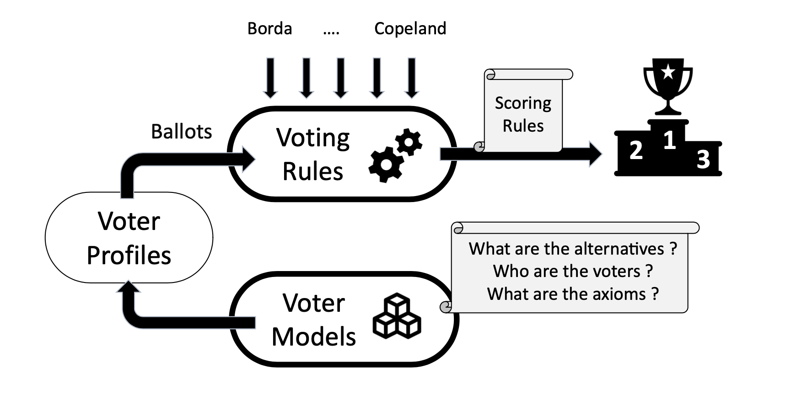
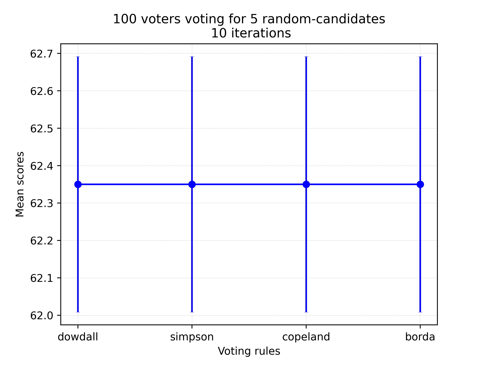
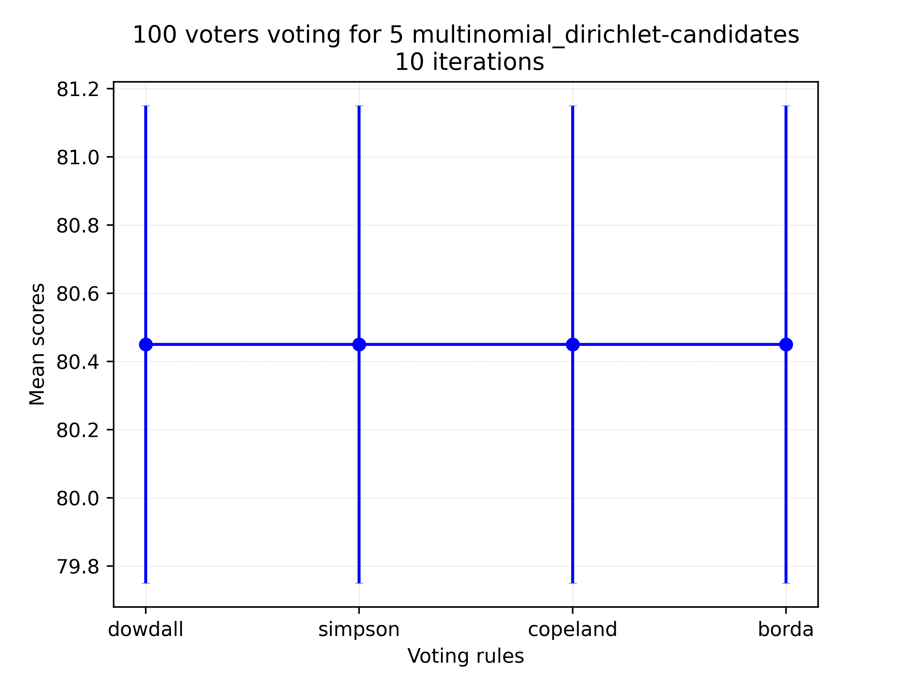

<a  name="_"></a>

<p align="center">
  <a href="https://github.com/raviq/compsoc">
    
  </a>
</p>

# Computational Social Choice Competition (COMPSOC) [](https://www.gnu.org/licenses/gpl-3.0)

## Description

This is a Python toolkit for the benchmarking of voting rules used in [computational social choice theory](https://en.wikipedia.org/wiki/Computational_social_choice). We particularly look at how voting rules would aggregate the collective decisions of populations of intelligent agents possessing parametric preferences and distributions. The toolkit allows you to programmatically define the [voter rules](https://en.wikipedia.org/wiki/Social_choice_theory) as well as the distributions of the voters, defined as [voter models](https://en.wikipedia.org/wiki/Voter_model). This is illustrated below.




The competitors would implement voting rules using the Python API (1). Given the chosen domain and axioms of the competition, we generate the population of the voters using voter models that specify how the voters' preferences are defined and how the voters are distributed. Once the voters and the rules are set, we run several trials and generate the results of the votes. Finally, We evaluate the voting rules based on the social welfare they provide to the voters.

### Voting rules
The voting rules are defined in terms of scores. That is, the rule takes a candidate and returns its score. The obtained scores for all of the candidates could then be used to determine the winner(s). For instance, the `Borda` score is implemented in `profile.py` as following.

```python
def borda(self, candidate):
    # Max score to be applied with borda count
    top_score = len(self.candidates) - 1
    # Get pairwise scores
    scores = [n_votes * (top_score - ballot.index(candidate))
                for n_votes, ballot in self.pairs]
    # Return the total score
    return sum(scores)
```

Other scores could be re-defined in `profile.py`.

### Voter Models
In general, voters rank the candidates according to preferences that are often defined as permutations over the set of candidates. Such preferences could be defined in different ways.

Another way to define the voter models is to assume that the votes follow particular distributions. In the following, we define the distribution of the votes according to 3 methods.

1. Random distribution of the votes, implemented in
```python
generate_random_votes(number_voters, number_candidates)
```

2. Gaussian distribution of the votes, implemented in
```python
generate_gaussian_votes(mu, stdv, number_voters, number_candidates)
```

3. Dirichlet-Multinomial distribution of the votes, implemented in
```python
generate_multinomial_dirichlet_votes(alpha, num_voters, num_candidates)
```

## Files

The main files of the package are:
| File | Description |
| ---- | --- |
| [**run.py**](./run.py) | This is the main entry point. Takes the number of candidates `num_candidates`, the number of voters `num_voters`, the number of trials to run `number_iterations`, and the model `voters_model` to generate the voters' population. |
| [**models.py**](./models.py) | Defining the models to adopt when generating the popuations of the voters. There are currently Random, Gaussian, and Multinomial-Dirichlet models. |
| [**profile.py**](./profile.py) | All voting rules are defined and extended in the `Profile` class. |
| [**utils.py**](./utils.py) |  Rendering utils. |

### Usage
```
python3.9 run.py [-h] [-v] num_candidates num_voters num_iterations voters_model
```
### Examples

To run 10 trials with `Dowdall`, `Simpson`, `Copeland`, and `Borda` rules for 5 candidates and 100 voters with random votes, run the command:
```
python3.9 run.py 5 100 10 "random"
```
The visual result is generated in `figures/scores_random.png`



Similarly, for a Multinomial-Dirichlet distribution of the votes, run the following command:

```
python3.9 run.py 5 100 10 "multinomial_dirichlet"
```
The result is generated in `figures/scores_multinomial_dirichlet.png`



## Dependencies
* Python3.9
* Numpy
* Matplotlib
* Pandas
* [Tqdm](https://github.com/tqdm/tqdm)

## Licence & Copyright
This software was developed in the hope that it would be of some use to the AI research community, and is freely available for redistribution and/or modification under the terms of the GNU General Public Licence. It is distributed WITHOUT WARRANTY; without even the implied warranty of merchantability or fitness for a particular purpose. See the [GNU General Public License](https://github.com/raviq/Genon/blob/master/LICENCE.md) for more details.

If you find this code to be of any use, please let me know. I would also welcome any feedback.

Copyright (c) 2022 Rafik Hadfi, rafik [dot] hadfi [at] gmail [dot] com
